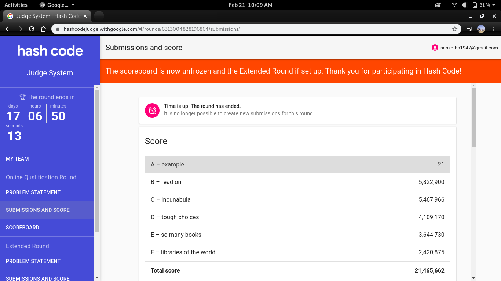

# Google-Hashcode-2020
* Problem statement given in PDF  
* Input data files in "input" folder
* Output stored in "output"
* Main code is "code.py". Written in python 2.7

To execute, run ```python code.py``` or with your corresponding python 2.7 like ```python2.7 code.py```  

# Scores
* A - example: 21
* B - read on: 5,822,900
* C - incunabula: 5,467,966
* D - tough choices: 4,109,170
* E - so many books: 3,644,730
* F - libraries of the world: 2,420,875 
  
**Total: 21,465,662**
  

